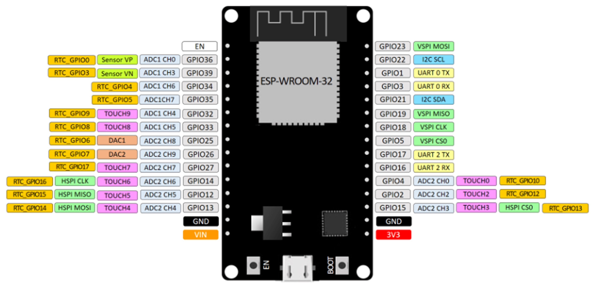

# MAC-Address

## Placa de desarrollo implementada

### DOIT ESP32 DEVKIT V1

La tarjeta DOIT ESP32 DevKit V1 es una placa de desarrollo basada en el chip ESP32 de Espressif Systems
Destaca por su potente microcontrolador de dos núcleos, esta característica permite que el dispositivo funcione con mayor eficiencia y rendimiento. 
Adicionalmente, este microcontrolador de bajo costo y alto rendimiento combina Wi-Fi y Bluetooth en un solo chip, lo que lo hace ideal para una amplia gama de aplicaciones de IoT (Internet de las cosas) y proyectos de desarrollo. Su principal característica es la integración del protocolo de comunicación inalámbrica ESP-NOW, que permite la comunicación directa entre dispositivos ESP32 sin necesidad de un enrutador Wi-Fi.

### PINOUT

## SOFTWARE

### FINALIDAD

El objetivo es actuar como un punto central que facilita la interconexión entre dispositivos que no pueden comunicarse directamente entre sí debido a limitaciones de alcance, protocolos o tecnologías incompatibles.

En una red que utiliza ESP-NOW, el gateway juega un papel crucial al funcionar como un intermediario que permite que los dispositivos de la red se comuniquen con otros dispositivos externos o con servicios en la nube. Actúa como un puente que traduce los mensajes o datos recibidos de los dispositivos locales a un formato o protocolo que pueda ser comprendido por el destino final fuera de la red local.

### ESTRUCTURA

El código proporcionado es un ejemplo que muestra cómo utilizar el protocolo de comunicación ESP-NOW en un dispositivo ESP32 para controlar un LED de manera remota desde otro dispositivo. El programa se ejecuta en un nodo de la red ESP-NOW, que actúa como el receptor de los comandos enviados por un dispositivo remoto, conocido como el iniciador.

En este código, se incluyen las librerías necesarias para el funcionamiento del programa, como las de FreeRTOS para la gestión de tareas, las de ESP-NOW para la comunicación inalámbrica, y otras para el manejo de pines GPIO y la configuración de Wi-Fi.

El programa comienza inicializando el módulo Wi-Fi del ESP32 y configurándolo en modo estación (STA). También se inicia el protocolo ESP-NOW y se registran las funciones de devolución de llamada para recibir y enviar datos. Se registra el dispositivo remoto en la red ESP-NOW para establecer la comunicación.

Una vez que todo está configurado, el programa entra en un bucle infinito donde se alterna el estado del LED cada segundo. Cuando el LED cambia de estado, se envía la información del nuevo estado al dispositivo remoto a través de ESP-NOW.