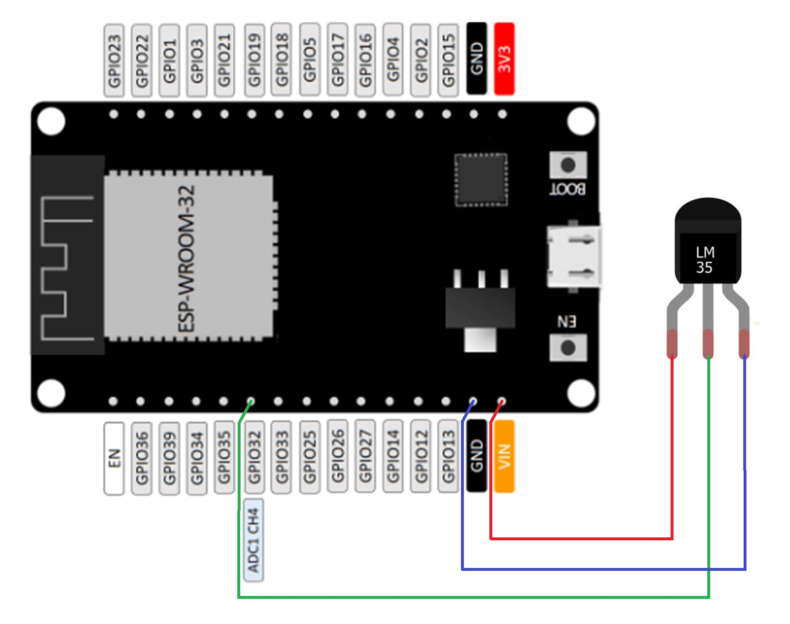

# MAC-Address

## Placa de desarrollo implementada

### DOIT ESP32 DEVKIT V1

La tarjeta DOIT ESP32 DevKit V1 es una placa de desarrollo basada en el chip ESP32 de Espressif Systems
Destaca por su potente microcontrolador de dos núcleos, esta característica permite que el dispositivo funcione con mayor eficiencia y rendimiento. 
Adicionalmente, este microcontrolador de bajo costo y alto rendimiento combina Wi-Fi y Bluetooth en un solo chip, lo que lo hace ideal para una amplia gama de aplicaciones de IoT (Internet de las cosas) y proyectos de desarrollo. Su principal característica es la integración del protocolo de comunicación inalámbrica ESP-NOW, que permite la comunicación directa entre dispositivos ESP32 sin necesidad de un enrutador Wi-Fi.

### PINOUT

### SENSOR LM35

Es un dispositivo semiconductor que mide la temperatura ambiente con alta precisión. Proporciona una salida de voltaje lineal que es proporcional a la temperatura en grados Celsius. Es ampliamente utilizado debido a su simplicidad y precisión, lo que lo convierte en una opción popular para aplicaciones de detección de temperatura en proyectos electrónicos y sistemas integrados.

## SOFTWARE

### FINALIDAD

El objetivo es un dispositivo que participa en la comunicación inalámbrica de forma unidireccional o bidireccional utilizando el protocolo ESP-NOW. En este protocolo, los nodos se organizan en un sistema de red donde uno de ellos actúa como "Initiator" (iniciador) y los demás como "Responders" (respondedores).

### ESTRUCTURA

El código proporcionado comienza incluyendo diversas librerías necesarias para el funcionamiento del programa, como las librerías para el sistema operativo en tiempo real FreeRTOS, las librerías para el protocolo ESP-NOW, para configurar y gestionar el módulo Wi-Fi del ESP32, para manejar interfaces de red, para obtener la dirección MAC, para gestionar eventos, entre otras.

Luego, se definen varias constantes que serán utilizadas en el programa, como el número de canal para ESP-NOW, el número del pin que controla un LED, y algunas constantes relacionadas con el módulo ADC y la lectura del sensor LM35.

El código sigue con la declaración de funciones que serán utilizadas más adelante en el programa, como la función para inicializar el Wi-Fi, la función de devolución de llamada para recibir datos mediante ESP-NOW, la función de devolución de llamada para enviar datos mediante ESP-NOW, la función para inicializar el protocolo ESP-NOW, la función para registrar un dispositivo remoto en ESP-NOW, la función para inicializar el módulo LM35 y la función para leer la temperatura del sensor LM35.

A continuación, se inicializa una variable de tipo esp_adc_cal_characteristics_t que será utilizada para almacenar las características calibradas del módulo ADC.

Luego, se define y se inicializa una variable de tipo float llamada lm35_value, que será utilizada para almacenar el valor de temperatura del sensor LM35.

Posteriormente, se define una variable de tipo uint8_t llamada initiator_mac, que representa la dirección MAC del dispositivo remoto (initiator) al que se enviarán los datos de temperatura.

El código sigue con la implementación de funciones. La función init_wifi() se encarga de inicializar el módulo Wi-Fi del ESP32, configurarlo en modo estación (STA) y ponerlo en funcionamiento.

La función recv_cb() es una función de devolución de llamada que se ejecutará cada vez que se reciban datos a través de ESP-NOW. En esta función se verifica si los datos recibidos tienen un tamaño válido y se utiliza el primer byte para controlar el estado de un LED conectado al pin LED_PIN. También muestra un mensaje en los logs para indicar la recepción del estado del LED.

La función send_cb() es una función de devolución de llamada que se ejecutará después de enviar datos a través de ESP-NOW. Esta función muestra mensajes en los logs indicando si el envío fue exitoso o si hubo algún fallo.

La función init_esp_now() inicializa el protocolo ESP-NOW y registra la función de devolución de llamada recv_cb() para recibir datos.

La función register_peer() registra el dispositivo remoto en ESP-NOW, utilizando la dirección MAC especificada.

La función init_lm35() inicializa el módulo LM35 para realizar la lectura de la temperatura.

La función read_lm35() lee el valor del sensor LM35 utilizando el ADC y lo convierte a milivoltios, y luego lo convierte a grados Celsius y lo devuelve como un número flotante.

Finalmente, la función app_main() es la función principal del programa. En esta función, se inicializan todos los componentes necesarios (Wi-Fi, ESP-NOW, LM35, GPIO), se configura el LED como salida, y se inicia un bucle infinito para leer continuamente la temperatura del sensor LM35, enviarla al dispositivo remoto mediante ESP-NOW y mostrar un mensaje en los logs indicando la temperatura enviada.