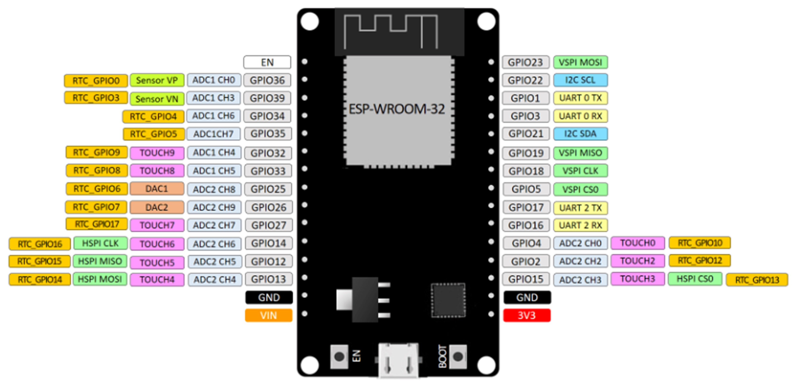

# MAC-Address

## Placa de desarrollo implementada

### DOIT ESP32 DEVKIT V1

La tarjeta DOIT ESP32 DevKit V1 es una placa de desarrollo basada en el chip ESP32 de Espressif Systems
Destaca por su potente microcontrolador de dos núcleos, esta característica permite que el dispositivo funcione con mayor eficiencia y rendimiento. 
Adicionalmente, este microcontrolador de bajo costo y alto rendimiento combina Wi-Fi y Bluetooth en un solo chip, lo que lo hace ideal para una amplia gama de aplicaciones de IoT (Internet de las cosas) y proyectos de desarrollo. Su principal característica es la integración del protocolo de comunicación inalámbrica ESP-NOW, que permite la comunicación directa entre dispositivos ESP32 sin necesidad de un enrutador Wi-Fi.

### PINOUT

## SOFTWARE

### FINALIDAD

El objetivo del código es obtener y mostrar la dirección MAC del dispositivo ESP32. 
La dirección MAC es una identificación única que permite identificar el dispositivo en una red local o en cualquier red a la que se conecte el ESP32.

### ESTRUCTURA

El código comienza importando las bibliotecas necesarias para interactuar con el módulo Wi-Fi del ESP32, manejar registros de mensajes y realizar operaciones con las direcciones MAC.
A continuación, define una etiqueta llamada "TAG" para identificar los mensajes de registro.
Luego, implementa la función "init_wifi" que se encarga de inicializar el módulo Wi-Fi del ESP32 en modo estación (STA). Esta función configura la red, inicializa la memoria flash no volátil (NVS) y obtiene la dirección MAC del módulo Wi-Fi en modo estación. 
Posteriormente, muestra la dirección MAC en el registro utilizando el mecanismo de registro "ESP_LOGI".
Finalmente, la función principal "app_main" llama a "init_wifi" para obtener y mostrar la dirección MAC del dispositivo ESP32 en el registro de mensajes.
